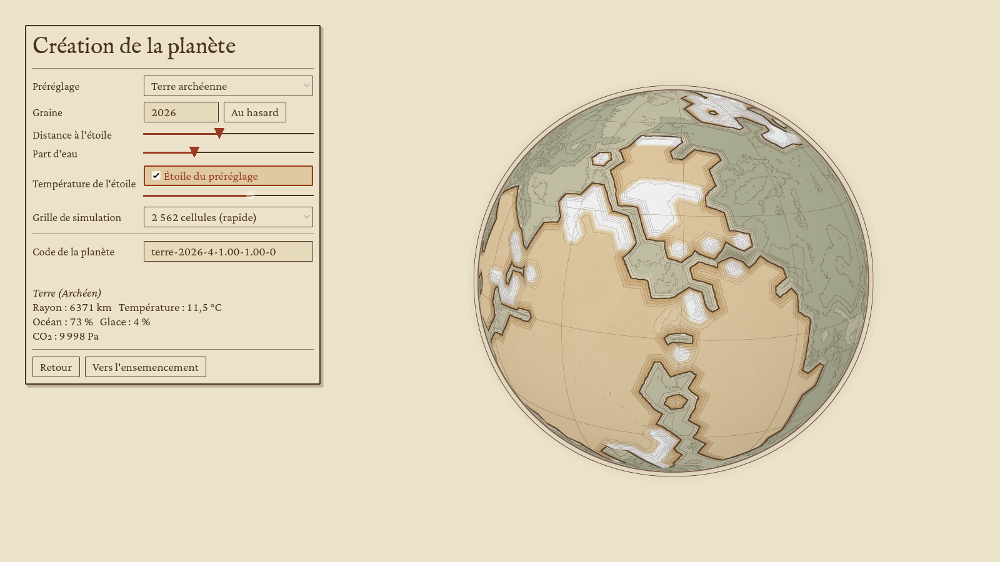
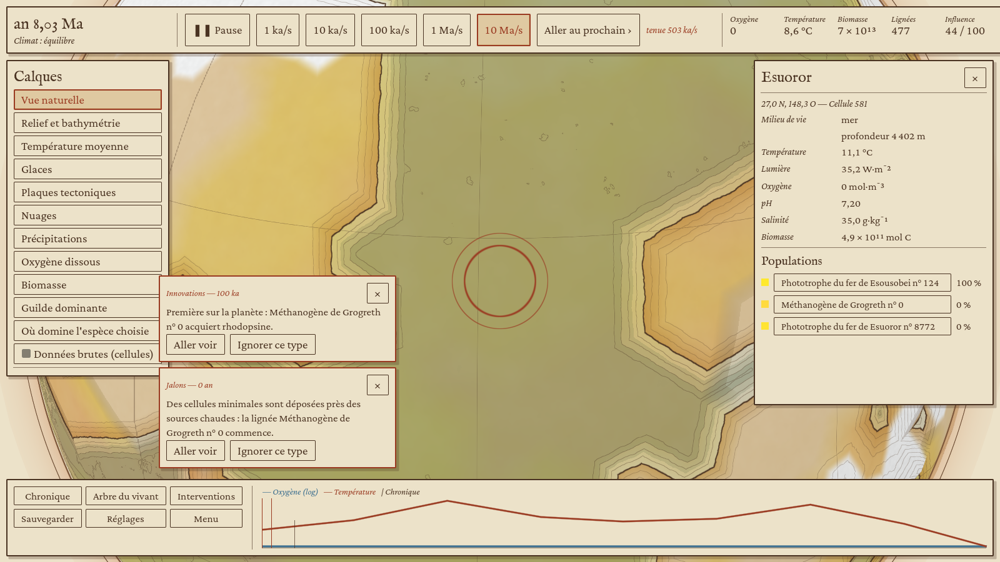
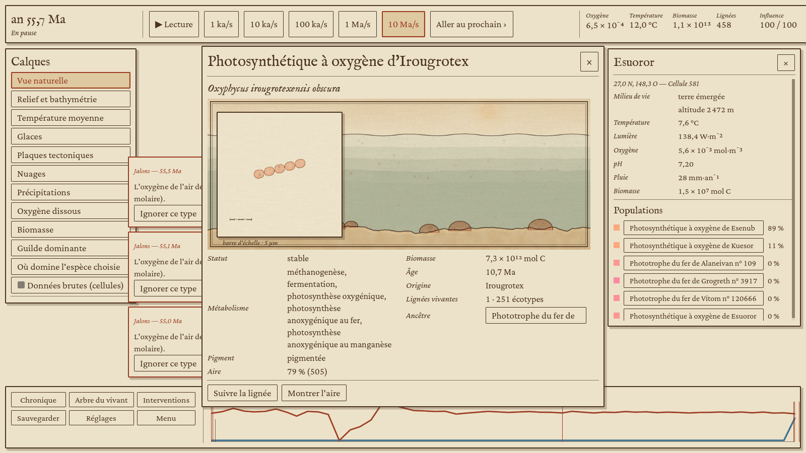
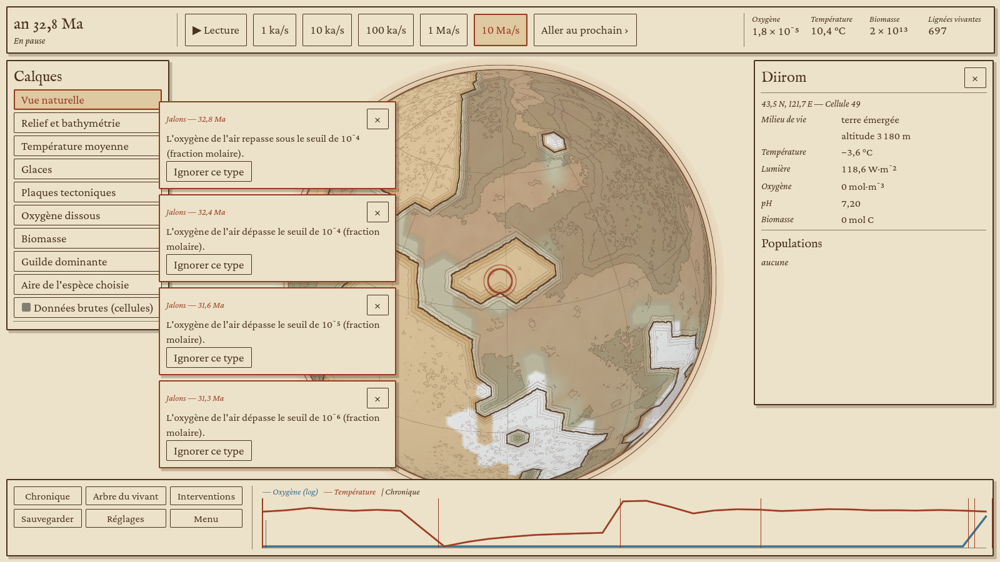

# Étape 3, volet client : le globe et le premier jouable

Feuille de route (document Vision, périmètre consolidé de l'étape 3) : le client Godot (crate `evo-godot` et dossier `client/`), le globe G1 et G2 dans la direction artistique Atlas naturaliste, les écrans du premier jouable, evo-morph au palier 1 et le décor de milieu au palier 1. Porte, côté client : le joueur crée une planète, l'ensemence, intervient et voit l'oxygène monter ; une partie se rejoue à l'identique quelle que soit la caméra ; le globe tient 60 images par seconde sur la machine cible.

**Verdict provisoire : porte franchie sur ce que ce conteneur peut vérifier, sauf les 60 images par seconde**, qui demandent une vraie carte graphique (voir « Mesures »). Le client est branché sur la crate `evo-engine` du volet moteur (PR #3) : il lit l'état que le moteur publie à chaque pas, l'interroge par requêtes asynchrones et lui écrit par la file d'ordres et la zone d'intérêt.

| Critère | Résultat | Preuve |
|---|---|---|
| Créer une planète | oui : préréglage, graine, distance à l'étoile, part d'eau, étoile, grille ; code de planète à partager | capture `02-creation.png` |
| Ensemencer | oui : près des sources hydrothermales ou dans toutes les mers | scénario, `vie_deposee` |
| Intervenir | oui : phosphate autour d'un lieu choisi, éruption (CO₂, méthane) ; le coût est pris sur la réserve d'influence, l'ordre passe par la file et revient dans la chronique comme « votre intervention » (ou « refusée ») | `intervention_appliquee` |
| Voir l'oxygène monter | oui : O₂ de l'air au-dessus de 10⁻⁴ à 32,6 Ma (Terre archéenne, graine 2026, 2 562 cellules), en 106 s de temps réel | `rapport.json`, capture `10-oxygene-frise.png` |
| Rejeu identique sur deux chemins de caméra | oui : même empreinte d'état après 20 pas (40 en intégration continue), caméra lointaine sur l'équateur ou plongée sur un pôle | `rejeu.json` |
| Rejeu après rechargement d'un point de sauvegarde | oui : même empreinte | `rejeu.json` |
| Rejeu identique sous Linux et Windows | comparé par l'intégration continue (job bloquant), maintenant que le moteur calcule avec des fonctions mathématiques déterministes | job `client-rejeu-identique` |
| 60 images par seconde sur la machine cible | non vérifiable ici : 3 images par seconde en rendu Vulkan logiciel (lavapipe, 4 cœurs) ; le pont coûte 0,6 ms par image | « Mesures » |

## Ce que le joueur voit

**Le globe** est dessiné comme une planche d'atlas : mer en lavis bleu-gris, une passe de plus tous les 1 500 m de profondeur, isobathes et courbes de niveau tous les 1 000 m, terres à l'aquarelle ocre, trait de côte à l'encre tracé à main levée (un léger bruit sur la hauteur casse les arêtes de la grille), glace en papier laissé blanc, graticule tous les 30°, côté nuit en hachures croisées quand le jour et la nuit sont affichés, contour en double filet. Le limbe de l'atmosphère prend la couleur de l'air : brume orangée quand le méthane domine, bleu quand l'oxygène monte. Le vivant teinte les mers de la couleur réelle de son pigment, calculée sous le spectre de l'étoile.

Entre deux pas, les grandeurs continues sont interpolées et les continents glissent : chaque sommet recule le long de la vitesse de sa plaque (publiée par le moteur, en cm/an vers l'est et le nord) de la part du pas qui reste à jouer. La caméra envoie sa zone d'intérêt au moteur par le canal d'observation, qui ne change jamais l'histoire.

**Les calques** posent une donnée à la fois en lavis sous l'encre, avec une légende graduée : relief et bathymétrie, température, glaces, plaques (avec leurs flèches de vitesse), nuages, précipitations, oxygène dissous, biomasse, espèce dominante, aire où domine l'espèce choisie. Les palettes sont lisibles par les daltoniens (viridis, cividis, divergentes adaptées, catégories d'Okabe et Ito) et changent avec le réglage de vision des couleurs. Un calque de catégories, ou la bascule « données brutes », montre les cellules telles qu'elles sont, sans fondu.

**L'inspecteur** dit le milieu d'une cellule en clair (mer, lacs, terres ; pH, salinité, pluie, apports d'une source hydrothermale, que le moteur détaille à la demande) et liste ses lignées avec leur part de biomasse ; la loupe dessine les cellules à l'encre, à l'échelle (barre de 5 µm). **La fiche d'espèce** (à cette ère, une espèce est une guilde métabolique) pose la planche de l'organisme devant le décor de son milieu de vie, peint à partir du milieu type que le moteur calcule (ciel teinté par l'air, mer ou lac, fonds, cheminées hydrothermales, stromatolithes, espèces voisines) ; elle donne le nom savant et le nom commun, le métabolisme, l'aire, l'âge, les lignées et écotypes, l'ancêtre, et permet de suivre sa lignée fondatrice ou de montrer son aire en hachures vermillon.

**Le temps** : pause, cinq crans de 1 ka/s à 10 Ma/s, « aller au prochain » événement notable, et la vitesse réellement tenue, en vermillon quand elle reste loin de la demande. **Les règles d'arrêt** (profils contemplatif, naturaliste, tout voir, puis réglage famille par famille) décident ce que fait le temps quand un événement survient : rien, le noter, une alerte, ralentir, s'arrêter ; le client arrête le temps par un ordre, inscrit au registre du moteur. **La frise** trace l'oxygène et la température depuis le début avec les événements marqués ; **la chronique** les liste, filtrés par famille et par recherche, chacun menant à son lieu ; **l'arbre du vivant** montre les lignées vivantes et leurs ancêtres, les branches sans descendance repliées.

**Les interventions** agissent sur l'environnement autour du lieu choisi sur le globe, jamais sur les gènes, avec leur coût en influence face à la réserve (affichée en haut, rechargée avec le temps) et un aperçu des effets attendus ; un point de sauvegarde est écrit juste avant. **Les sauvegardes** sont des points de sauvegarde complets du moteur (état et base d'historique), avec à côté une petite fiche lisible (nom, planète, date) ; une partie reprise continue exactement comme si elle n'avait pas été interrompue. **Les réglages** couvrent la langue (français, anglais), la taille de l'interface et du texte, cinq modes de vision des couleurs dont un contraste élevé, une police très lisible (Atkinson Hyperlegible), Celsius ou kelvins, les mouvements réduits, la sauvegarde automatique, le relief exagéré, le graticule, le jour et la nuit, le narrateur. **Le narrateur discret** de la première partie dit une phrase à la fois, déclenchée par l'état de la partie.

## Architecture

| Crate ou dossier | Rôle |
|---|---|
| `evo-view` | Ce que le client tire du moteur, sans Godot : état publié par le moteur avec la planète (`Frame`), maillage du globe et cellule sous un rayon, textures de données des calques, palettes accessibles, mise en forme des nombres et des dates (français, anglais), noms des espèces et des lieux, phrases de la chronique et règles d'arrêt, arbre élagué, décor de milieu, fiches de sauvegarde. Testée en Rust (28 tests). |
| `evo-morph` | Dessin à l'encre des organismes au palier 1 : formes des microbes (coques, bâtonnets, spirilles, filaments) tirées de leurs traits, champ de la loupe, planche avec barre d'échelle. |
| `evo-godot` | Extension GDExtension (godot-rust) : la classe `EvoSession`, seule porte du GDScript vers le moteur. Elle tient un `evo_engine::Engine` (son fil, son groupe de fils de calcul : tous les cœurs moins deux, réservés à l'affichage), lit l'état publié du dernier pas, jamais l'état en cours de calcul, relève une fois par image les réponses de ses requêtes (événements, lignées, historique, détail d'une cellule) et n'écrit que des ordres et sa zone d'intérêt. Décors, loupes et figures interrogent le moteur depuis des tâches de fond. |
| `client/` | Projet Godot 4.6 : globe, shaders Atlas, écrans, scénario de la porte (voir `client/README.md`). |

Le moteur place le pôle nord sur l'axe z ; Godot met le haut sur y. La conversion se fait à un seul endroit, à la frontière (`evo-godot`).

## Mesures

Conteneur de développement : 4 cœurs Xeon à 2,8 GHz, sans carte graphique ; rendu Vulkan logiciel (lavapipe, LLVM 20) sous Xvfb, fenêtre de 1 600 × 900. Partie jouée de la porte, Terre archéenne, 2 562 cellules, 10 Ma/s demandés.

| Mesure | Valeur |
|---|---|
| Vitesse tenue par le moteur | environ 400 ka/s pendant que le client dessine |
| Images par seconde | 3 (médiane), rendu logiciel |
| Durée d'une image | 133 ms (médiane), 146 ms (95ᵉ centile) |
| Pont Rust → Godot (textures de données d'un pas) | 0,59 ms en moyenne, 2,1 ms au plus |

Le rendu logiciel dessine chaque pixel sur le processeur, qu'il partage avec la simulation : ces 3 images par seconde ne disent rien de la machine cible. Le globe compte une seule surface de 10 242 sommets au niveau 5 (40 962 au niveau 6) et un shader de fragment sans texture d'image, ce qu'une carte graphique d'entrée de gamme dessine bien au-delà de 60 images par seconde ; la mesure reste à faire sur la machine cible, avec le scénario `--porte` qui la consigne dans `rapport.json`.

## Limites et suites

- **Sources hydrothermales sur le globe.** L'état publié ne les marque pas cellule par cellule : l'inspecteur les montre (détail d'une cellule), le globe pas encore. À demander au moteur si l'écran d'ensemencement doit les cercler.
- **Hauteur d'eau des lacs.** Le décor prête 20 m de profondeur à un lac, faute de donnée publiée.
- **Arbre du vivant.** Avec des centaines de lignées vivantes, l'élagage replie beaucoup de branches ; le compte de chaque groupe replié est affiché.
- **60 images par seconde.** À mesurer sur la machine cible (voir « Mesures »).
