# Étape 4, volet client : branches, outils de naturaliste, corps et paysages

Feuille de route (document Vision, « Périmètre consolidé de l'étape 4 ») : côté client, les branches et le rejeu « avec et sans », le globe G3 (régions et paysages), l'anatomie depuis le plan de construction avec evo-morph au palier 2, le comparateur, le réseau trophique, les impacts, l'isolement et la poussée climatique, la colonne stratigraphique, le décor de milieu avec les silhouettes des espèces voisines. Porte, côté client : le rejeu reste identique d'un système à l'autre, et une branche « avec et sans » se compare dans l'interface.

**Verdict : porte franchie sur ce que ce conteneur peut vérifier.** Le scénario `--porte4` (Terre, graine 2026, niveau 4) passe de bout en bout ; l'intégration continue le rejoue sous Linux, et compare toujours les empreintes de rejeu entre Linux, Windows et macOS. Les 60 images par seconde restent à mesurer sur une vraie carte graphique.

| Critère | Résultat | Preuve |
|---|---|---|
| Une branche « avec et sans » se compare dans l'interface | oui : après un impact de 10 km à 6 Ma, « Et sans ? » rejoue la planète sans lui depuis le point de sauvegarde écrit juste avant ; la branche rattrape la partie (2 s, rejouée pendant la pause) ; le tableau compare 7 grandeurs à la même date, 6 jalons, deux courbes, et le globe montre l'écart (espèce dominante changée sur 5,4 % de la carte) | captures 03 et 04, `rapport.json` |
| Une branche sans rien retirer rejoue exactement la partie | oui : même empreinte d'état que la partie principale | test `evo-engine` `branch::tests` |
| Rejeu identique d'un système à l'autre | comparé par l'intégration continue (moteur et client), inchangé | jobs `rejeu` et `client-rejeu-identique` |
| Impacts, isolement, poussée climatique | oui : barrière et anomalie posées, rejouées à l'identique après rechargement | capture 02, test `impacts_barriers_and_climate_pulses_act_and_replay` |
| Réseau trophique | oui : 8 espèces, 22 liens dans la cellule de l'impact | capture 05 |
| Colonne stratigraphique | oui : 24 couches, couche à iridium de l'impact | capture 06 |
| Globe G3 | oui : région subdivisée puis paysage (98 304 triangles) | captures 12, 13, 14 |
| Anatomie depuis le plan, palier 2 | oui : corps 3D des microbes (adaptateur) et d'un plan d'essai pluricellulaire (9 644 triangles, 21 os) | captures 08, 10, 11 |
| Comparateur | oui : 14 lignes, même échelle, ancêtre commun | capture 09 |
| Décor avec les silhouettes des voisines | oui | capture 07 |
| 60 images par seconde | non vérifiable ici (rendu logiciel) | |

## Ce que le joueur voit

**Interventions de l'étape 4.** Le panneau des interventions s'enrichit d'un impact météoritique (diamètre de 0,3 à 30 km), d'un isolement par un bras de mer ou une chaîne de montagnes (longueur, orientation, durée) et d'une poussée climatique (écart de température, facteur de pluie, rayon, durée). L'aperçu des effets est calculé par le moteur : rayon de destruction, CO₂ libéré, hiver d'impact, échelonnés sur Chicxulub (3,1·10²³ J ; rayon ∝ E^1/3 ; refroidissement de 10 K pendant une dizaine d'années, plus long pour un plus gros bolide). Barrières et anomalies se dessinent sur le globe tant qu'elles durent.

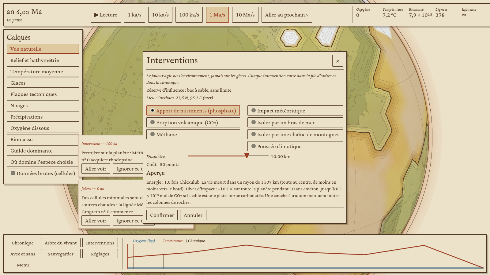
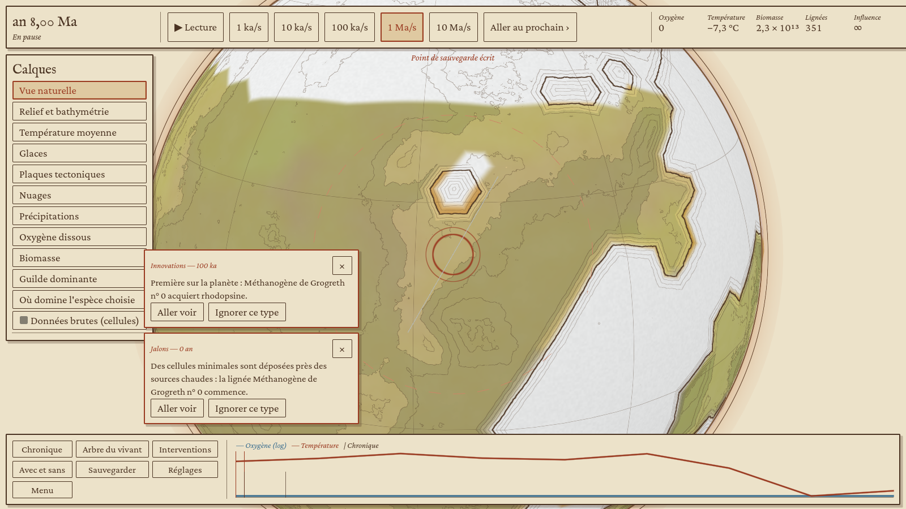

**Avec et sans** (touche A). Chaque intervention écrit un point de sauvegarde juste avant elle. « Et sans ? » recharge ce point sur la même graine, retire l'ordre, et rejoue la suite des ordres du joueur sur son propre fil, en même temps que la partie ou seulement pendant les pauses (la partie garde alors toute sa vitesse). Le tableau compare les grandeurs à la même date, les jalons (photosynthèse, montée de l'oxygène) et les courbes, et un calque montre sur le globe l'écart de biomasse et où l'espèce dominante a changé.

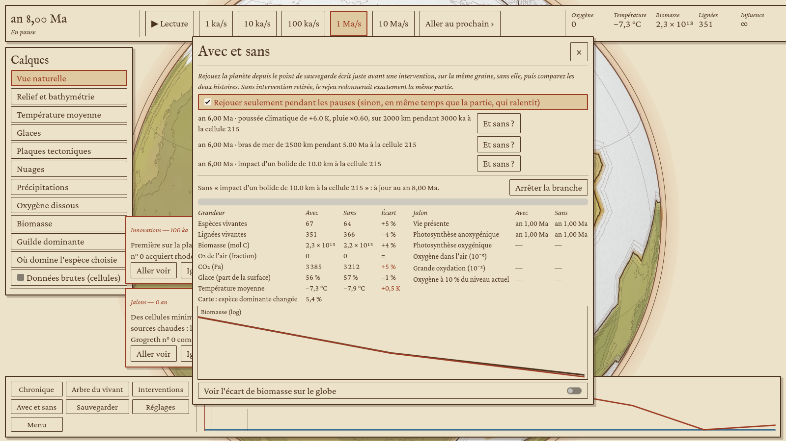
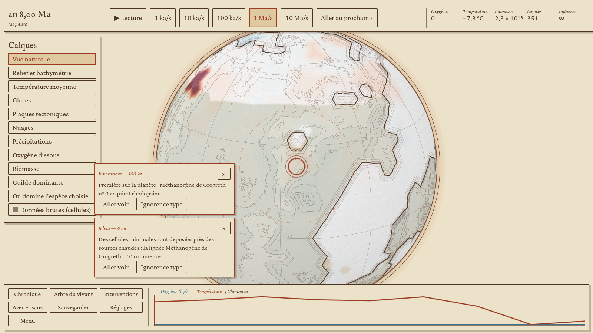

**Réseau trophique** (depuis l'inspecteur) : les producteurs en bas, ceux qui vivent de leurs produits au-dessus ; trait plein pour la matière organique, trait fin pour les échanges de gaz et de sulfure, tireté vermillon pour la compétition ; l'épaisseur suit le flux estimé. **Colonne stratigraphique** : les couches que la partie a déposées dans la région, avec motif conventionnel par roche (calcaire, marnes, schistes noirs, fer rubané, grès, grès rouges, tillite), δ¹³C des carbonates (Kump et Arthur, 1999), stromatolithes et couche à iridium des impacts.

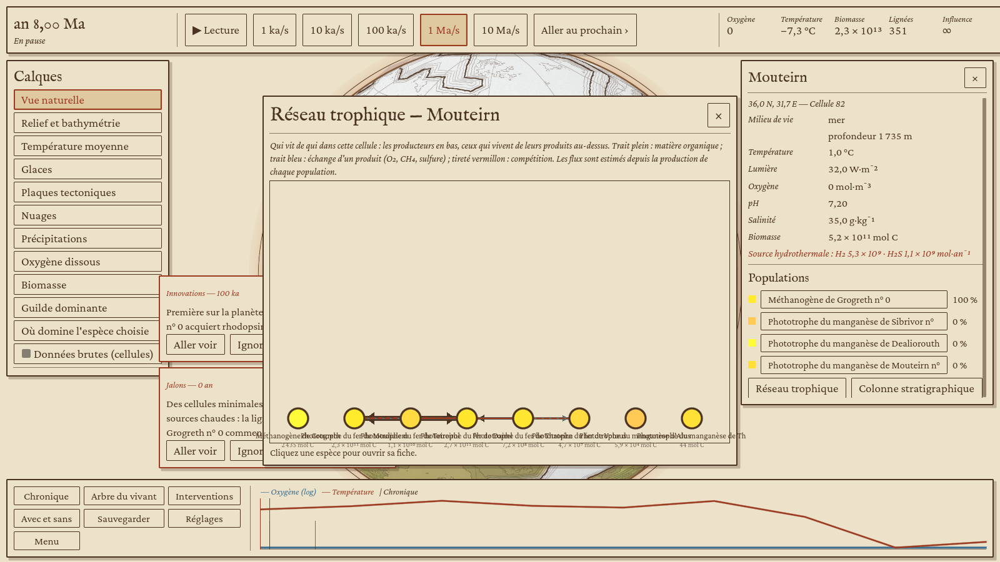
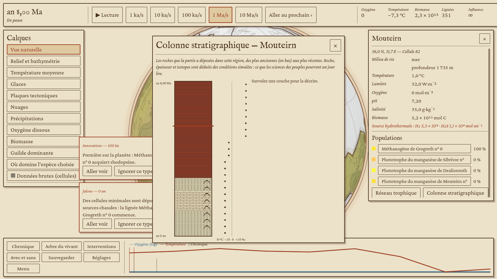

**Globe G3.** Aux bandes Z3 et Z4, les triangles de la grille autour du point regardé sont subdivisés en quatre, récursivement (jusqu'à 1 024 sous-triangles par triangle), et reçoivent un relief fractal reproductible (haché de la graine et de la position) dont la moyenne par cellule est nulle. Les données (glace, température, biomasse) sont mêlées entre les trois cellules qui entourent chaque sommet, sans escaliers. Estompage de cartographe, hachures dans les ombres, courbes de niveau, contour d'encre en post-traitement ; près du sol, la caméra se redresse vers l'horizon et l'exagération du relief retombe de 15 à 8 fois. [Simplification] La rugosité vient du contraste d'altitude avec les voisines et de l'altitude, adoucie par la glace : le moteur ne publie ni roche ni âge par cellule.

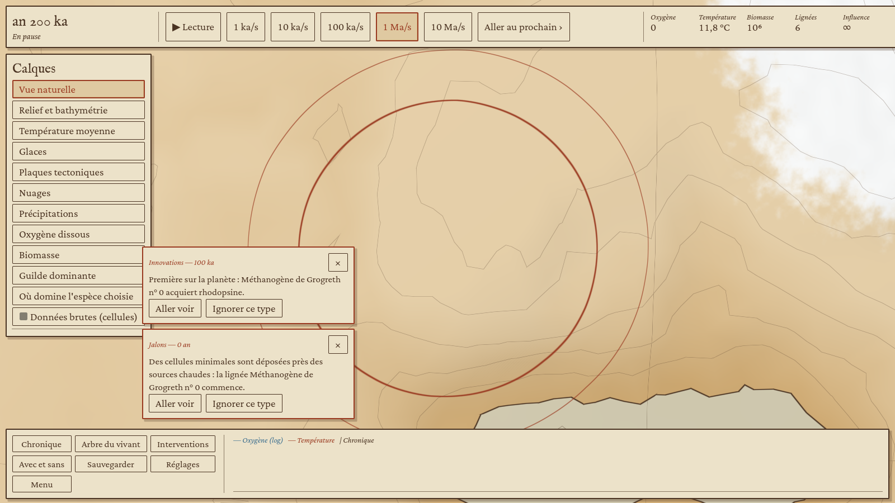
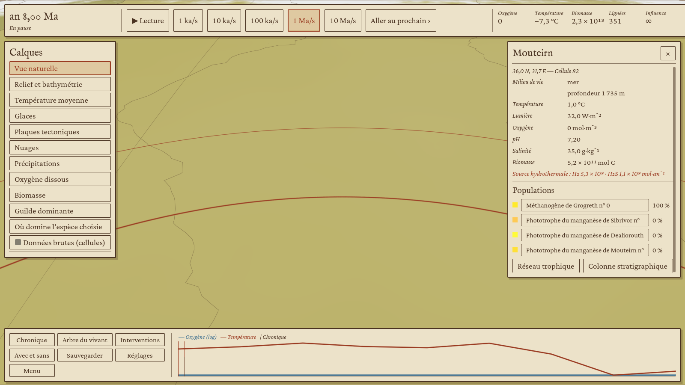

**Corps du vivant, palier 2** (crate `evo-morph`, module `body`). Le plan de construction (graphe de modules : parent et point d'attache, axe, dimensions, symétrie et répétitions, articulation, revêtement, pigments, irisation) devient une primitive par module, symétrie appliquée (miroir, ordre n, segments), fusionnées par union douce en champ de distance signée et maillées par surface nets à trois niveaux de détail. Couleur des pigments, motif de Turing (Gray-Scott) calculé une fois en texture, poids de peau par la primitive la plus proche, organes internes à part pour la vue anatomie. Le portrait est encré dans Godot (lavis, hachures dans l'ombre, contour à la plume) avec une barre d'échelle en vraie grandeur.

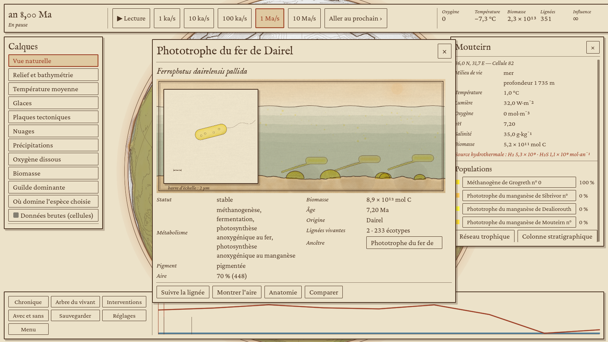
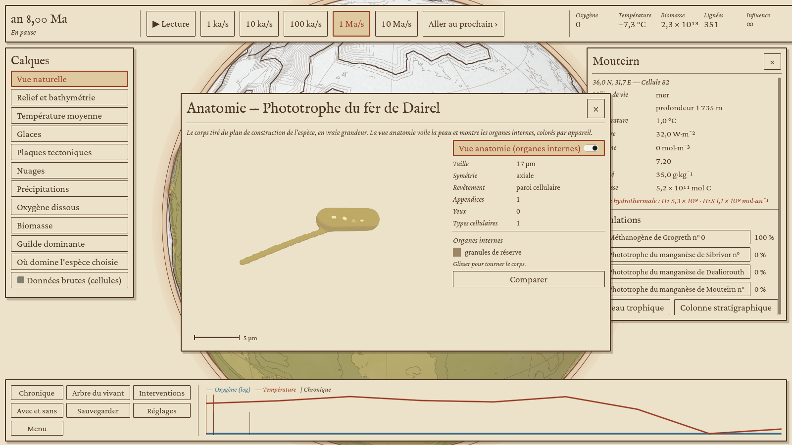
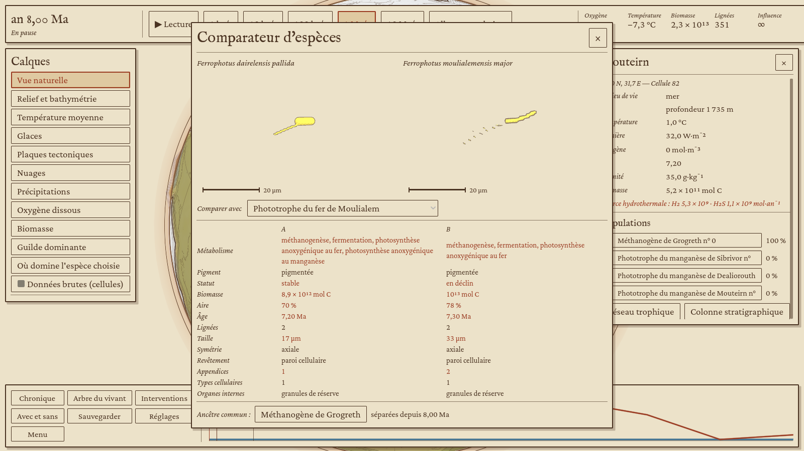
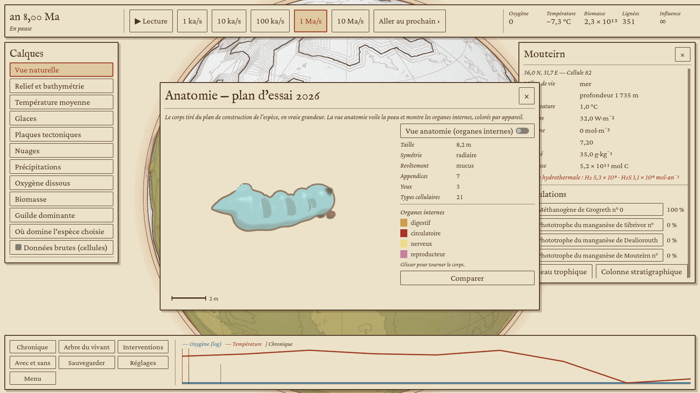
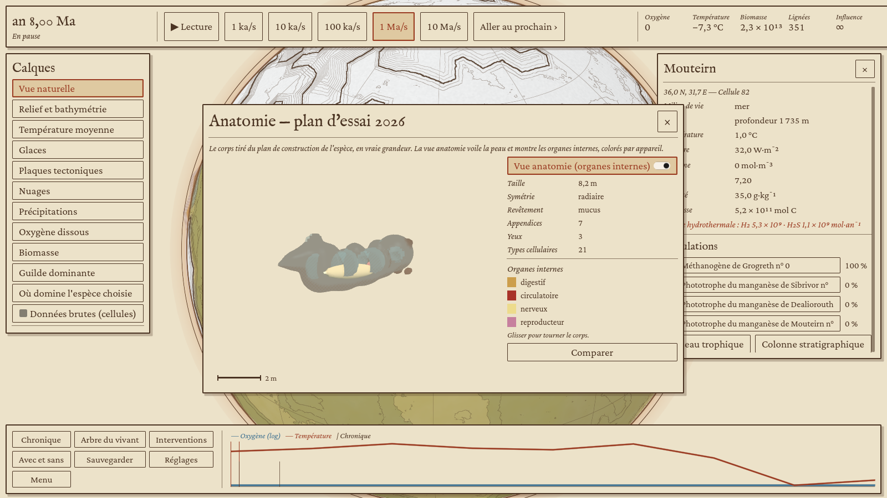

**Sauvegardes en arbre.** Une sauvegarde faite après en avoir rechargé une autre se range sous elle dans l'écran d'accueil.

## Limites connues et suites

- **Plan de construction.** Le moteur ne publie pas encore le plan des corps pluricellulaires (fil « cellules complexes »). evo-morph lit son propre type d'affichage (`evo_morph::body::BodyPlan`, champs du doc Organismes) ; les microbes y passent par un adaptateur depuis la forme du palier 1. Quand le plan simulé sera publié, il suffira d'un adaptateur de plus.
- **Format de sauvegarde 4** : les perturbations (barrières, anomalies) sont sauvegardées ; les sauvegardes des étapes précédentes sont refusées.
- Les pièces rigides fusionnent dans la peau au lieu d'être des maillages séparés, et les yeux restent des ellipsoïdes sombres quel que soit leur stade.
- Le relief d'une région se recalcule toutes les 200 étapes, pas à chaque pas.

## Lancer

```sh
cargo build --release -p evo-godot
godot --path client --resolution 1600x900 -- --porte4 --niveau=4 --sortie=/tmp/porte4
```
