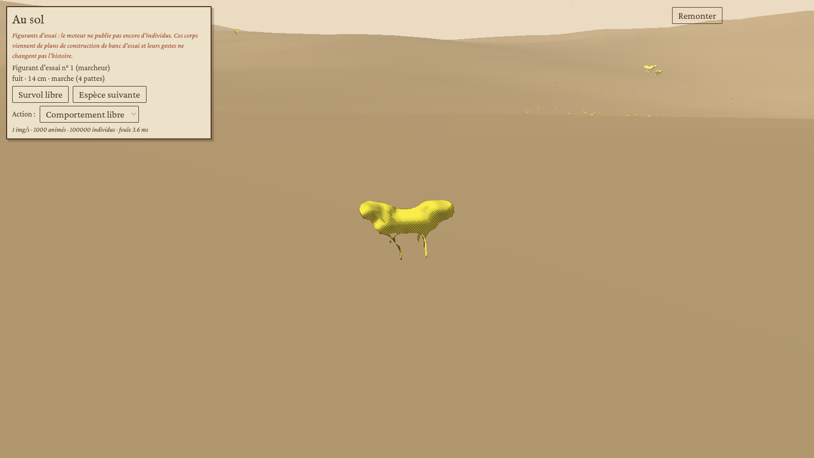
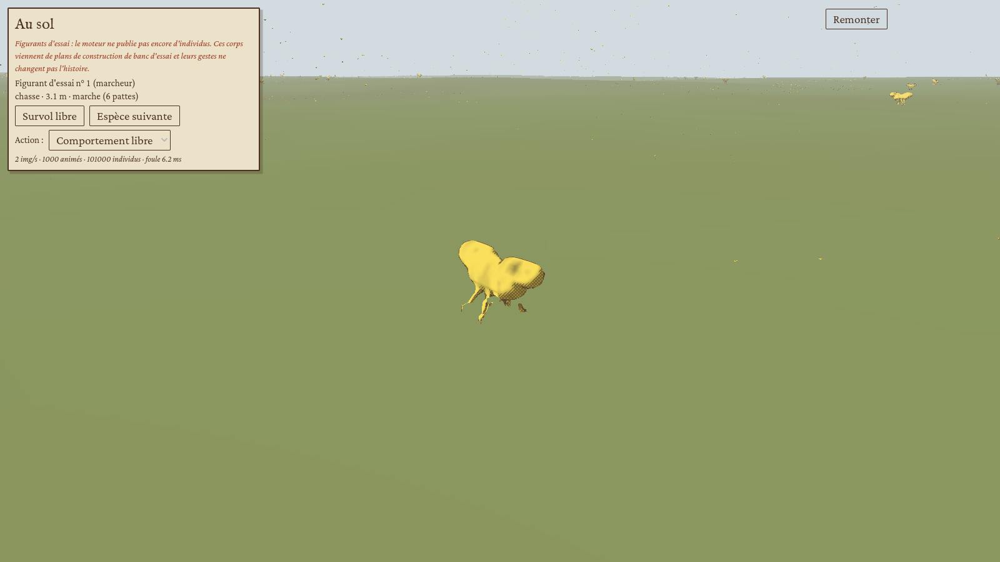
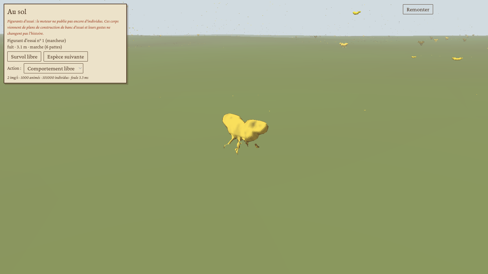
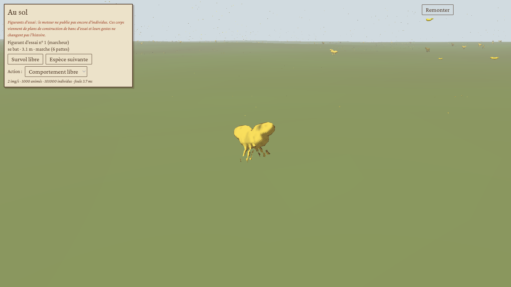
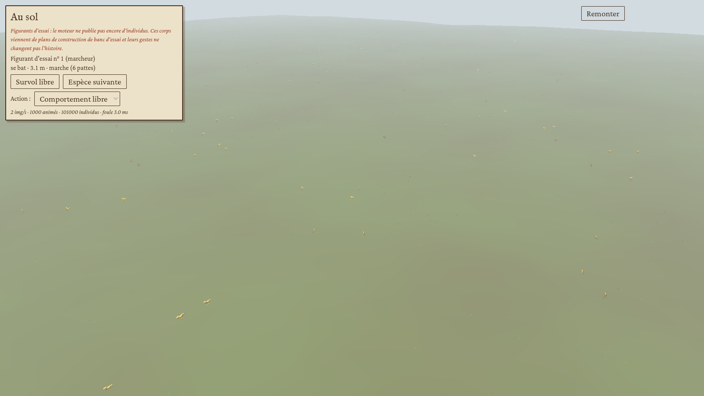
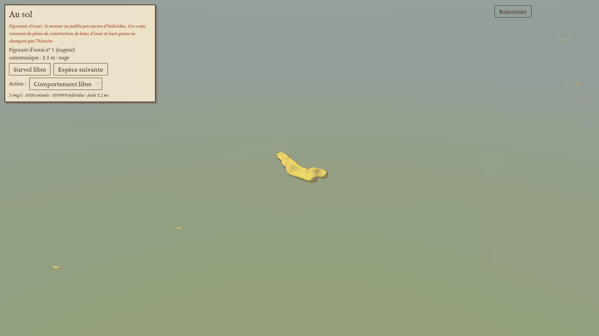
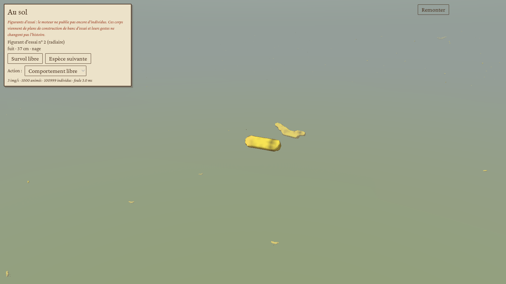

# Étape 5, volet client : les animaux à l'écran

Feuille de route (document Vision, étape 5) : evo-morph au palier 2 avec des corps complets, un squelette automatique, une animation procédurale et des foules en imposteurs ; le zoom jusqu'à l'individu et une caméra de suivi ; la descente au sol vers une scène locale (globe, incrément G4) ; une animation par action du lexique commun (12 actions). Porte : suivre un individu au sol à 60 images/s avec au moins 1 000 individus animés et 100 000 imposteurs.

Ce volet a été fait en parallèle du moteur (calibrage et cellules complexes), sans toucher à son code. Le moteur ne publie pas encore d'individus : **la scène est peuplée de figurants d'essai**, dont les corps viennent de plans de construction au format du moteur (`evo_life::BodyPlan`). L'écran le dit au joueur.

**Verdict : porte franchie pour ce que ce conteneur peut vérifier ; les 60 images/s restent à mesurer sur une vraie carte graphique.** Le scénario `--porte5` passe de bout en bout et tourne dans l'intégration continue.

| Critère | Résultat | Preuve |
|---|---|---|
| Au moins 1 000 individus animés | oui : 1 000, les plus proches de la caméra | `rapport.json` |
| Au moins 100 000 imposteurs | oui : 100 000 (101 000 individus en tout) | `rapport.json` |
| Descendre au sol depuis une partie | oui : sur la Terre à 0,2 Ma, le globe plonge sur le plus haut massif hors des glaces, la scène se construit depuis la cellule (roche nue, ciel sans oxygène), puis « Remonter » rend le globe | capture 00, `--porte4 --seul=sol` |
| Suivre un individu au sol | oui : la caméra suit un individu, change d'espèce, passe en survol libre ; un clic sur un animal le suit | captures 01, 04, 10 |
| Une animation par action du lexique | oui : les 12 actions imposées tour à tour à l'individu suivi, chacune jouée et capturée | `rapport.json`, captures 01 à 13 |
| Terre et mer | oui : marcheurs, voiliers, vers ; nageurs, méduses | captures 14, 15, 16 |
| Coût de la foule côté processeur | 3,6 ms par image sur terre, 3,4 ms en mer (101 000 individus, sur un processeur que partage le rendu logiciel) ; scène construite en 1,2 s en tâche de fond | `rapport.json` |
| 60 images par seconde | non vérifiable ici : le rendu du conteneur est logiciel (llvmpipe, 2 à 3 images/s pour toute la scène) | |
| Le curseur de vitesse ne change pas l'histoire | oui : deux trajectoires de curseur (et deux caméras) donnent la même empreinte d'état ; le curseur ne règle plus que le rythme d'affichage | scénario `--porte --rejeu`, job `client-linux` |

## Ce que le joueur voit

**Descente au sol.** Dans l'inspecteur d'une cellule, « Descendre au sol » fait plonger le globe vers elle, puis la scène locale se pose par-dessus : un carré de 2,4 km dont le relief, l'eau, la couleur du vivant et la teinte du ciel viennent de la cellule (température, glace, pigments, oxygène et méthane de l'atmosphère, couleur de l'étoile). « Remonter » (ou Échap) rend le globe.

**Les habitants.** Les animaux proches sont des corps 3D animés, dessinés comme les planches de l'Atlas : lavis du pigment, hachures d'encre dans les ombres, liseré sur le pourtour. Au loin, chaque individu est un imposteur : une vue pré-rendue de son espèce, choisie parmi huit selon l'angle sous lequel la caméra le voit. Les espèces vraies de la cellule dont le corps mesure au moins un millimètre rejoignent les figurants ; à l'étape 4 il n'y en a guère, ce sont des colonies.

**La caméra.** Elle suit un individu (molette pour s'approcher, clic droit pour tourner autour), passe d'une espèce à la suivante, ou survole librement (flèches). Un clic sur un animal le suit. Le panneau donne l'espèce, l'action en cours, la taille et le mode de locomotion, et permet d'imposer une action à l'espèce suivie (banc d'essai).









## Comment c'est fait

**Squelette automatique** (`evo_morph::body::rig`). Chaque os du corps (un par module du plan) reçoit un rôle : colonne, tête, patte, lame (nageoire, aile), fouet (flagelle, antenne), tige, feuille, partie rigide. Le mode de locomotion en découle : marche s'il y a au moins deux pattes qui partent de la colonne vers le bas, vol si deux lames latérales sont plus longues que la moitié du corps (hors de l'eau), nage à flagelle, nage ou reptation par ondulation, ou fixé. Les pattes sont classées d'avant en arrière et reçoivent leur phase d'allure (diagonale, tripode, alternée) ; les bras d'une couronne (méduse) ne sont pas des pattes.

**Animation procédurale.** Une pose est une transformation par os, composée de la racine vers les extrémités. Elle dépend de l'action (12 styles : port de tête, balancement, accroupissement, ouverture des membres, inclinaison du corps), de la vitesse en longueurs de corps par seconde (allure de fuite, de chasse, de migration…) et du temps : onde latérale de la colonne, battement des pattes, battement des ailes et des nageoires, onde le long des fouets, respiration. Tout est déterministe et testé (`rig::tests`).

**Rendu.** Une espèce = un `MultiMesh`. La texture des poses tient une ligne par individu animé et trois texels par os ; le shader des animaux (`animal.gdshader`) la lit avec `INSTANCE_ID` et déforme chaque sommet par ses deux os (sommet : UV = os, UV2 = poids). Les imposteurs (`imposteur.gdshader`) sont un seul `MultiMesh` de carrés tournés vers la caméra ; l'atlas tient huit vues de 64 px par espèce, calculées par lancer de rayons sur la forme (`impostor_views`).

**La foule** (`evo_view::ground`). À chaque image, les 1 000 individus les plus proches de la caméra sont animés et ont des comportements complets : fuir un prédateur à moins de 30 longueurs de corps, chasser et attraper une proie, suivre son troupeau, sinon tirer la prochaine action selon une table pondérée par espèce. Les lointains errent seulement et avancent par quarts (un quart par image, avec un pas quadruple). Le terrain est un champ de bruit fractal réglé sur l'altitude et la rugosité de la cellule.

## Données de remplacement à retirer

- **Individus** : les figurants et leurs comportements sont tirés dans le client. Quand le moteur publiera des individus (volet moteur de l'étape 5), la scène les lira à leur place ; rien de ce que font les figurants ne remonte au moteur.
- **Plans de banc d'essai** (`bench_plan`) : marcheurs, nageurs, vers, radiaires et voiliers écrits au format du moteur, pour développer sans attendre que la simulation produise des animaux. Leurs formes sont encore grossières.
- **Relief fin** : la cellule ne décrit que l'altitude moyenne ; la rugosité suit l'altitude (simplification).

## Changement hors de la scène : le curseur de vitesse

Règle de Vision du 2026-10-09 : le curseur de vitesse ne change jamais l'histoire. Le client n'envoie plus d'ordre de durée du pas quand le joueur change de vitesse ; le curseur ne règle que le frein du moteur, donc le rythme d'affichage. La durée du pas suit le temps simulé et l'état du monde, côté moteur (fil Calibrage et vitesse). Le scénario de rejeu fait maintenant varier le curseur sur l'un de ses deux chemins : même empreinte d'état (`d1174a9400ec8ecc` au pas 16, niveau 4) sur les deux chemins et après rechargement.

À signaler au moteur : la pause et la reprise restent des ordres de la file ; la règle de Vision ne les vise pas, mais ce point est à confirmer avec elle.

## Lancer

```
cargo build --release -p evo-godot
godot --path client -- --porte5 [--graine=2026] [--total=101000] [--animes=1000] [--sortie=DOSSIER]
```

Le rapport (`rapport.json`) donne les effectifs, les actions jouées, les images par seconde, le temps de la foule par image et la pire image. Sur une machine avec une vraie carte graphique, c'est ce chiffre d'images par seconde qui tranche la porte.
