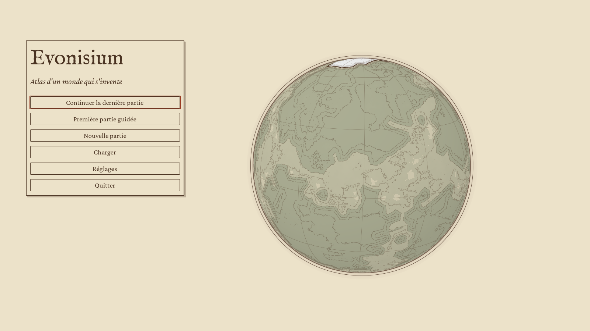
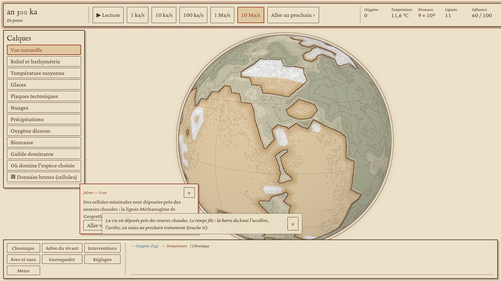
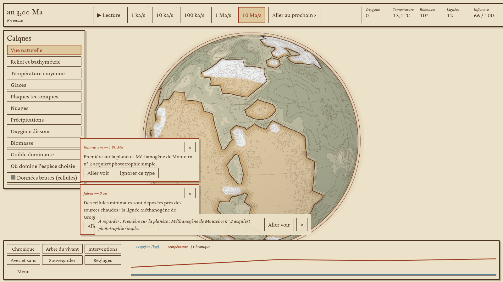
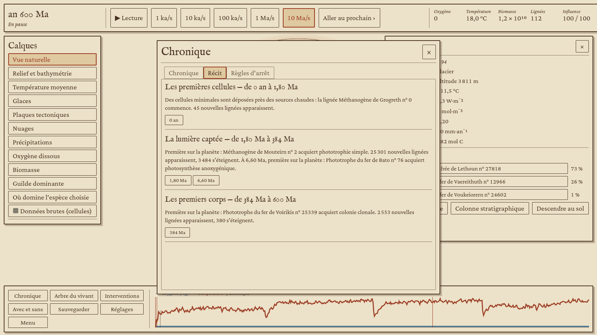
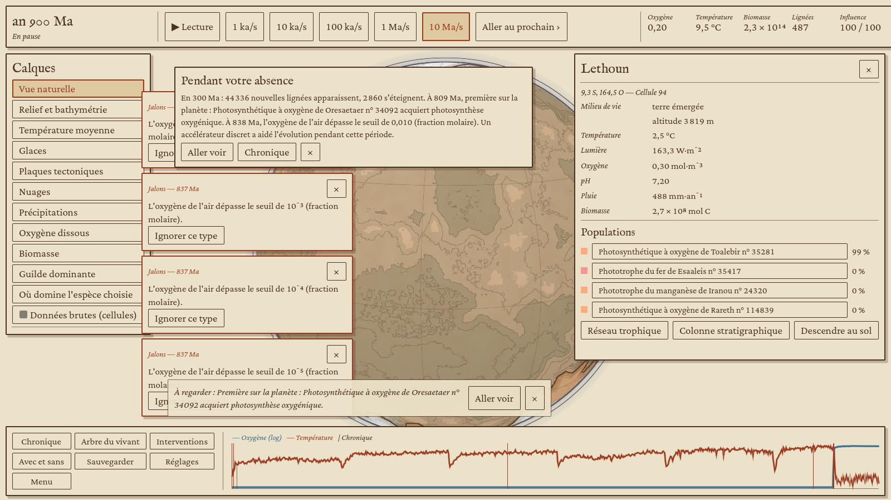

# Première partie guidée, conseiller et chronique en récit

Le choix de l'utilisateur du 8 octobre 2026 voulait une première partie guidée par un narrateur discret. Vision l'a avancée de l'étape 7 (2026-10-10), parce qu'elle ne dépend que des événements notés par intérêt et de la chronique. Ce volet client l'ajoute, avec trois améliorations de la chronique. Il ne touche ni au moteur ni au module son.

## Ce que le joueur voit

**« Première partie guidée »**, en tête de l'accueil tant que le guide n'a pas été suivi jusqu'au bout (ensuite plus bas, pour recommencer). La partie se joue sur la Terre, avec une graine connue (2026) et la vie déposée près des sources chaudes. Le guide repart alors du début.

**Le guide.** Une phrase à la fois, en bas de l'écran, jamais bloquante. Chaque phrase présente un outil au moment où il devient utile, et l'outil est souligné d'un cadre vermillon qui pulse lentement (il reste fixe avec « réduire les animations »). La phrase s'en va au bout de 18 s, avec ×, ou dès que le joueur ouvre l'outil. Si le joueur a trouvé un outil tout seul, sa présentation est sautée. Les phrases vues sont gardées d'une partie à l'autre (réglage `guide_vu`). « Conseils du narrateur », dans les réglages, coupe tout.

| Phrase | Outil souligné | Quand |
|---|---|---|
| temps | barre du temps | dès le début |
| inspecteur | globe | après 2 Ma |
| loupe | inspecteur | une cellule est choisie |
| arbre | arbre du vivant | première nouvelle lignée |
| frise | frise | premier événement notable |
| calques | calques | 3 lignées et 20 Ma |
| pigment | barre (oxygène) | premier pigment |
| chronique | chronique | 3 événements notables |
| réseau | inspecteur | 6 lignées, une cellule choisie |
| interventions | interventions | oxygène au-dessus de 10⁻⁴ ou 400 Ma |
| avec et sans | « Avec et sans » | première intervention du joueur |
| strates | inspecteur | 500 Ma, une cellule choisie |
| eucaryote | fiche | cellule complexe |
| corps | anatomie | premier corps (colonie) |
| sol | inspecteur | sortie des eaux |

**Le conseiller.** Le guide épuisé (ou entre deux phrases), le narrateur signale de temps en temps un événement qui vaut d'être regardé : « À regarder : … », avec un bouton « Aller voir ». Il ne dit jamais quoi faire. Il se tait sur les actes du joueur et sur ce qui n'est pas au moins notable, et laisse au moins 75 s entre deux conseils. Seuil : un intérêt d'au moins 0,6.

**La chronique en récit.** Un onglet « Récit » s'ajoute à la chronique. Il découpe la partie en chapitres, un par grand basculement, et en donne une page d'histoire naturelle. Chaque chapitre porte des boutons datés qui mènent aux moments qu'il cite. Les chapitres sont : Les premières cellules, La lumière captée, L'air change, La cellule complexe, Les premiers corps, La conquête des terres. Chacun s'ouvre au premier de ses basculements, dans l'ordre où la planète les a vécus. Sur la Terre de la graine 2026, une colonie clonale (384 Ma) précède la cellule complexe.

**Pendant votre absence.** Après 45 s sans clic ni touche, au retour du joueur, une carte résume ce qui a changé depuis la dernière date regardée. Elle donne les naissances et les extinctions, les moments marquants (des seuils d'oxygène franchis d'affilée, seul le dernier est dit), les interventions du joueur et l'aide de l'accélérateur. Ses boutons sont « Aller voir » et « Chronique ».

## La voix

Le narrateur parle par l'interface du module son, sans la modifier. Il appelle `Son.dire(texte, 1)` : la priorité 1 est aussi celle des moments clés du documentaire (fil Design sonore), et les deux se suivent sans se couper ; seules les demandes du joueur (2) coupent la parole. Le texte reste dans le cartouche du narrateur tant que la voix le dit (signal `phrase_finie`, 60 s au plus). L'interface a été convenue avec le fil Design sonore. Tant que le module son ne sait pas parler, l'appel est sauté (`has_method`) et le texte reste à l'écran.

## Comment c'est fait

- `evo_view::guide` : les phrases (français et anglais), leurs conditions sur l'état de la partie (années, lignées, spéciations, événements notables, étape de la photosynthèse, oxygène, complexité cellulaire, interventions, outils ouverts, cellule choisie) et le choix de la suivante. Ce module donne aussi le seuil et la forme des conseils.
- `evo_view::story` : les chapitres, le texte de chaque période (bilan des lignées, quatre moments au plus parmi les plus intéressants, interventions, accélérateur) et le résumé d'absence. Seules les interventions comptent comme actes du joueur : l'ensemencement, la pause et les règles d'arrêt n'en sont pas.
- `EvoSession` (`session/story.rs`) : `guide_next`, `guide_finished`, `advice_for`, `story`, `absence`.
- Client : `ui/narrateur.gd` (guide et conseiller), `screens/jeu.gd` (cadre de l'outil souligné, carte d'absence, outils ouverts), `ui/chronique.gd` (onglet du récit), `screens/accueil.gd` et `screens/ensemencement.gd` (partie guidée). `atlas.gd` habille enfin les onglets aux couleurs de l'Atlas : ils étaient restés gris foncé.

## Essai

```
godot --path client --resolution 1600x900 -- --porte4 --seul=guide [--arrets=non] --sortie=DOSSIER
```

Le scénario part de l'accueil, lance la partie guidée et la mène à 600 Ma en s'arrêtant à 0,2, 3, 30 et 200 Ma. Il lit chaque phrase montrée et fait ce qu'elle propose quand c'est simple : choisir une cellule, ouvrir la chronique. Il ouvre ensuite le récit, avance de 300 Ma sans geste, puis appuie sur une touche pour faire paraître la carte d'absence. Le rapport donne les phrases, les chapitres, le texte d'absence et l'empreinte de l'état à 600 Ma.

**Résultat dans ce conteneur** (Terre, graine 2026, niveau 4) : porte franchie. 14 phrases du guide ont été montrées, dont un conseil sur la première phototrophie simple. Le récit compte trois chapitres à 600 Ma : Les premières cellules, La lumière captée, Les premiers corps. La carte d'absence paraît au retour. Les pauses du guide ne changent pas l'histoire : avec ou sans les quatre arrêts, l'état à 600 Ma est le même (112 lignées, biomasse 11 690 781 531,2297 mol C). L'empreinte du moteur diffère, parce qu'elle compte aussi les événements, dont les ordres de pause. La CI (job `client-linux`) joue ce scénario.






